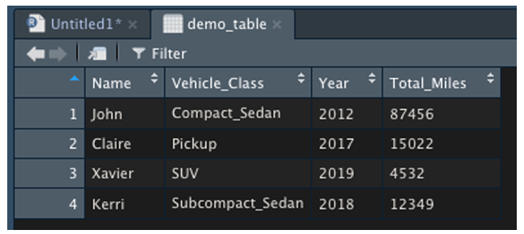
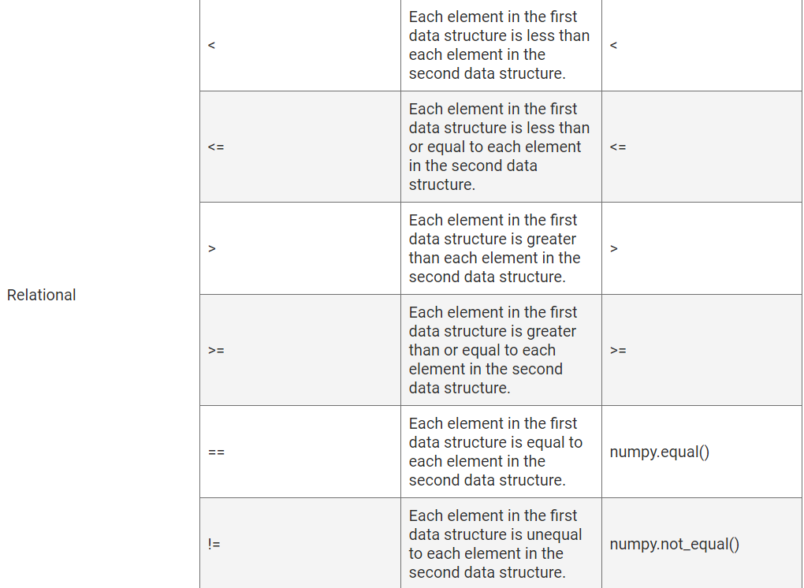
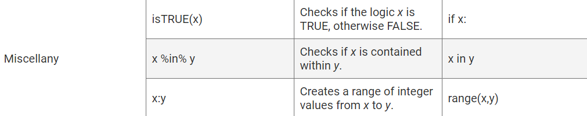

# R_analysis

## Functions in R

```install.packages()```

```c()```

Regardless of where a function comes from, all R functions use the same basic syntax:

```
function_name <- function(arg1, arg2=T, …){

<BODY OF FUNCTION>

return <RETURN VALUE>
}
```

There are four components of an R function:

- The function name is the name of the function, which can be used in the R console to call the function itself.
- Just like Python methods, R functions can have any number of required or optional arguments, depending on the design of the function.
- The function body includes data structures, if-statements, and other logical statements that define what the function does.
- The return statement is the last evaluated statement before returning the resulting value out of the function.

If at any point you are unsure what an R function does or what it needs to execute, you can always type ```?<name of function>```  in the R console and it'll open the documentation in the Help pane. 

## Read and Write Using R

There are built-in R functions to import the most common data formats, such as comma-separated values (CSV) and JavaScript Object Notation (JSON)

- To read in a CSV file, we use R's ```read.csv()``` 

```?read.csv()```

- We can use ```read.csv()`` for comma-delimited files.
- ```read.delim()``` for tab-delimited files.
- ```read.table()```  if we need to manually tell the function what delimiter is used.

Although optional arguments are used to parse more complicated datasets, we'll only concentrate on the following arguments:

- file
- header
- sep
- check.names
- stringsAsFactors

To practice reading in a CSV file, first download our sample CSV file demo.csv

- After ```demo.csv``` has downloaded, place the data file into your active working directory.
- Next, we'll use ```read.csv()``` in our source RScript pane to read in the demo file into our R environment.
- Type the following code:

  ```demo_table <- read.csv(file='demo.csv',check.names=F,stringsAsFactors = F)```

- There are two ways to send RScript lines to our R console. We can either use the "Run" button in the top-right source pane or use the following shortcut:

**Command + Enter (Mac)**
**CTRL + Enter (Windows)**

 ### what if we want to bring in a dataset from an application programming interface (API) query?

 The JSON format is one of the most common data formats returned from a URL request. Although native JSON data can be easier to work with in Python, many data scientists still prefer to use R for their data analysis. To accommodate this need, R developers created the ```jsonlite``` library to read in JSON data structures and convert them to an R data frame. Because the ```jsonlite``` library was not built into R, we must import it into our R environment.
 To import a library into R, we'll use the ```library(package)``` function. Just like in Python, it's good practice to import any required libraries at the top of our RScript.
 Let's try loading in our installed ```jsonlite``` package using the ```library(jsonlite)``` function. Be sure to write the statement in your RScript and then send the statement to your R console (Command + Enter for Mac or CTRL + Enter for Windows).

- Now that we have successfully imported our ```jsonlite``` package, we can use the ```fromJSON()``` function to read in a JSON file into R.

- First, type the following code into the R console to look at the ```fromJSON()``` documentation in the Help pane:

```?fromJSON()```

As we can see, we only need to provide the txt argument to properly read in a JSON file into R because the other parameters have default values indicated with equations (e.g. simplifyVector=True). ```txt``` is the file path of the JSON file on our machine. Alternatively, we can provide the ```fromJSON()``` function a JSON URL directly. Now let's practice reading in our first JSON file.

Place the downloaded data file in your active working directory. Next, use ```fromJSON()``` in our source RScript pane to read in the used car data into our R environment, as follows:

```demo_table2 <- fromJSON(txt='demo.json')```

Now that we know how to create data structures and data frames in R, let's learn how to **slice and sample** our datasets.

## Select Data in R

There are many ways to select and subset data in R, depending on what data structure is being used. When it comes to vectors, the easiest way to select data is using the bracket ("[ ]") notation. For example, if we have a numeric vector x with 10 values and want to select the third value, we would use the following statements:

```x <- c(3, 3, 2, 2, 5, 5, 8, 8, 9)```

```> x[3]```

Unlike Python, R's index starts at 1. So, the third element would be ```index = 3```

You can also use bracket notation to select data from two-dimensional data structures, such as matrices, data frames, and tibbles. For example, let's look at our ```demo_table``` again:



If we want to select the third row of the Year column using bracket notation, our statement would appear as follows:

```demo_table[3,"Year"]```

Because R keeps track of both the row indices as well as the column indices as integers under the hood, we can also select the same data using just number indices:

```demo_table[3,3]```

There is a third way to select data from an R data frame that behaves very similarly to Pandas. By using the $ operator, we can select columns from any two-dimensional R data structure as a single vector, similar to selecting a series from a Pandas DataFrame. For example, if we want to select the vector of vehicle classes from demo_table, we would use the following statement:

```demo_table$"Vehicle_Class"```

Once we have selected the single vector, we can use bracket notation to select a single value.

```demo_table$"Vehicle_Class"[2]```

## Select Data with Logic

Just as it is for selecting single values, there are multiple ways to subset and filter data from our larger data frames. As with most programming languages, we use a combination of operators and logical statements to tell R what data to filter. Thankfully, most operators are the same between R and Python, as shown below:

Category	    R Operator    	Description	              Python Equivalent
Arithmetical	+	              Addition operator	        +
              -	              Subtraction operator	    -
              *	              Multiplication operator	   *
              /	              Division operator	         /
              ^ or **	        Exponent operator	         **
              %%	            Modulus operator (finds the remainder of the first element divided by the second)	%






One of the most common ways to filter and subset a dataset in R is to use bracket notation. To use bracket notation to filter a data frame, we can supply a logical statement to assert our row and columns.

For example, if we want to filter our used car data demo_table2 so that we only have rows where the vehicle price is greater than $10,000, we would use the following statement:

```filter_table <- demo_table2[demo_table2$price > 10000,]```

This filter statement generates a view-only data frame tab listing vehicles priced greater than $10,000

When our logical statements are simple (using only one or two operators), bracket notation is easy to read and write. However, if we need to filter and subset our data using more complicated logic, bracket notation can become cumbersome. In these cases, we'll use an R function such as ```subset()``` to filter our data.

## Subset Data in R

The subset() function uses a few arguments to subset and filter a two-dimensional R data structure:

- x
- subset
- select

For example, if we want to create a more elaborate filtered dataset from our used car data demo_table2 where price > 10000, drive == 4wd, and "clean" %in% title_status, we would use the following statement:

```filter_table2 <- subset(demo_table2, price > 10000 & drive == "4wd" & "clean" %in% title_status) #filter by price and drivetrain```

## Sample Data in R

Often in data science, we need to generate a random sample of data points from a larger dataset. For example, some models might take too long to run on a massive dataset and require a smaller sample of the data.

Using filtering and subsetting methods may be appropriate for certain cases (such as looking at data within a specific timeframe), but usually we'll want to randomly sample our larger data to reduce bias. In these cases, we can use the built-in function sample(). Let's try it now.

The sample() function uses a few arguments to create a sampled vector from a larger vector:

- x
- size
- replace

If we want to sample a large vector and create a smaller vector, we can set the vector to "x":

```sample(c("cow", "deer", "pig", "chicken", "duck", "sheep", "dog"), 4)```

When it comes to sampling a two-dimensional data structure, we need to supply the index of each row we want to sample. This process can be completed in three steps:

1. Create a numerical vector that is the same length as the number of rows in the data frame using the colon (:) operator.
2. Use the sample() function to sample a list of indices from our first vector.
3. Use bracket notation to retrieve data frame rows from sample list.

So, first capture the number of rows in demo_table in a variable. The nrow() function counts the number of rows in a dataframe.

```num_rows <- 1:nrow(demo_table)```

Next, sample 3 of those rows, as shown in this code:

``` sample_rows <- sample(num_rows, 3)```

Finally, retrieve the requested data within the demo_table:

``` demo_table[sample_rows,]```

If we want to combine all three steps in a single R statement, our code would be as follows:

```demo_table[sample(1:nrow(demo_table), 3),]```

## Transform, Group, and Reshape Data Using the Tidyverse Package

One of the most successful optimized packages for R is the tidyverseLinks to an external site. package. The tidyverse package contains libraries such as dplyr, tidyr, and ggplot2. These packages work together to help simplify the process of creating transformed data columns, grouping data using factors, reshaping our two-dimensional data structures, and visualizing our results using plots.

## Transform

Raw data is often insufficient in telling the full story. Usually when we are analyzing data, we want to perform calculations and incorporate the calculations back into the raw data to ease in downstream analysis. Tidyverse's dplyrLinks to an external site. library transforms R data.

The dplyr library contains a wide variety of functions that can be chained together to transform data quickly and easily. Using dplyr is slightly more complex than the simple assignment statement in R because dplyr allows the user to chain together functions in a single statement using their own pipe operator (%>%).

By chaining functions together, the user does not need to assign intermediate vectors and tables. Instead, all of the data transformation can be performed in a single assignment function that is easy to read and interpret. To transform a data frame and include new calculated data columns, we'll use the mutate() function.

Type the following code into the R console to look at the mutate() documentation in the Help pane:

```library(tidyverse)

 ?mutate()```

The documentation for the mutate() function (generally any dplyr function) is a little obscure, but it makes more sense looking at the examples. We can think of the mutate() function as a series of smaller assignment statements that are separated by commas. Each of the assigned names appears as a new column in our raw data frame.

For example, if we want to use our coworker vehicle data from the demo_table and add a column for the mileage per year, as well as label all vehicles as active, we would use the following statement:

```demo_table <- demo_table %>% mutate(Mileage_per_Year=Total_Miles/(2020-Year),IsActive=TRUE) #add columns to original data frame```

For each name and expression, a new column is generated within our returned data frame. This returned data frame is then assigned to our original data structure demo_table.

This process of mutating and transforming columns can be applied at any time (or even multiple times) within a dplyr pipe, and it can even reference columns that were generated from previous mutate() functions. These transformed data frames can be used in further downstream analysis, visualizations, and modeling. However, transformed data frames are not designed to summarize data. To summarize our data frames in R, we'll need to use a grouping function.

## Group Data

Just like in Python, grouping across a factor allows us to quickly summarize and characterize our dataset around a factor of interest (also known as a character vector in R, or list of strings in Python). The most straightforward way to perform a grouping on an R data frame is to use dplyr's group_by() function. The group_by() function tells dplyr which factor (or list of factors in order) to group our data frame by.

The behavior of group_by() is almost identical to that of the Pandas DataFrame.groupby() function, with the exception of using a value or vector instead of a list. Once we have our group_by data structure, we use the dplyr summarize() function to create columns in our summary data frame.

For example, if we want to group our used car data by the condition of the vehicle and determine the average mileage per condition, we would use the following dplyr statement:

``` summarize_demo <- demo_table2 %>% group_by(condition) %>% summarize(Mean_Mileage=mean(odometer), .groups = 'keep') #create summary table```

Dplyr's pipe operator allows us to move our connected functions to a new line while computing everything in the same assignment function. This allows you to write RScripts that are not too wide for your RScript window.
 
Using the summarize() function is very similar to using the mutate() function on a raw data frame: for each name and summary function, we create a column in a summary data frame. Our simplest summary functions will use statistics summary functions such as mean(), median(), sd(), min(), max(), and n() (used to calculate the number of rows in each category).

However, the dplyr summarize() documentation provides a more comprehensive list of functions that can be used to summarize our data. For example, if in addition to our previous summary table we wanted to add the maximum price for each condition, as well as add the vehicles in each category, our statement would look as follows:

```summarize_demo <- demo_table2 %>% group_by(condition) %>% summarize(Mean_Mileage=mean(odometer),Maximum_Price=max(price),Num_Vehicles=n(), .groups = 'keep') #create summary table with multiple columns```

The ```summarize()``` function takes an additional argument, .groups. This allows you to control the the grouping of the result. The four possible values are:

```.groups = "drop_last"``` drops the last grouping level (default)
```.groups = "drop"``` drops all grouping levels and returns a tibble
```.groups = "keep"``` preserves the grouping of the input
```.groups = "rowwise"``` turns each row into its own group

## Reshape Data

When performing more involved data analytics and visualizations, there may be situations where the shape and design of our data frame is overcomplicated or incompatible with the libraries and functions we wish to use. For example, a "wide" data frame with few rows and many columns and factors may be difficult to visualize. Or a "long" data frame may be difficult to analyze if it contains multiple rows for a single subject.

Thankfully, the tidyr library from the tidyverse has the gather() and spread() functions to help reshape our data. The gather() function is used to transform a wide dataset into a long dataset.

In addition to seeing ```gather()``` in use outside of class, you may also encounter the functions ```pivot_longer()``` and ```pivot_wider()```.

```pivot_longer()``` lengthens the data by increasing the number rows and decreasing the number of columns, while ```pivot_wider()``` will perform an inverse transformation.

To properly reshape an R data frame, the gather() function requires a few arguments:

- data
- key
- value
- …

For this example, first download the demo2.csvLinks to an external site. Once you have put the file in your active directory, load the demo2.csv file into your R environment and look at the top of the data frame:

```demo_table3 <- read.csv('demo2.csv',check.names = F,stringsAsFactors = F)```

The demo_table3 data frame contains survey results from 250 vehicles that were collected by a rental company. The rental company evaluated seven different metrics for each vehicle and rated each metric on a scale of 1 to 5, with 1 representing low and 5 representing high.

This data would be considered a wide format because different metrics were collected from a single vehicle, and each metric (also known as a variable in this case) was stored as a separate column. To change this dataset to a long format, we would use gather() to reshape this dataset.

Type the following function into the R console:

```long_table <- gather(demo_table3,key="Metric",value="Score",buying_price:popularity)```

Alternatively, you may type the following function in the R console:

```long_table <- demo_table3 %>% gather(key="Metric",value="Score",buying_price:popularity)```

By using the gather() function, we have collapsed all of the survey metrics into one Metric column and all of the values into a Score column. Because the Vehicle column was not in the arguments, it was treated as an identifier column and added to each row as a unique identifier.

Alternatively, if we have data that was collected or obtained in a long format, we can use tidyr's spread() function to spread out a variable column of multiple measurements into columns for each variable.

To properly reshape an R data frame, the spread() function requires a few arguments:

data
key
value
fill

Therefore, if we want to spread out our previous long-format data frame back to its original format, we would use the following spread() statement:

```wide_table <- long_table %>% spread(key="Metric",value="Score")```

And if we want to check if our newly created wide-format table is exactly the same as our original demo_table3, we can use R's ```all.equal()``` function:


